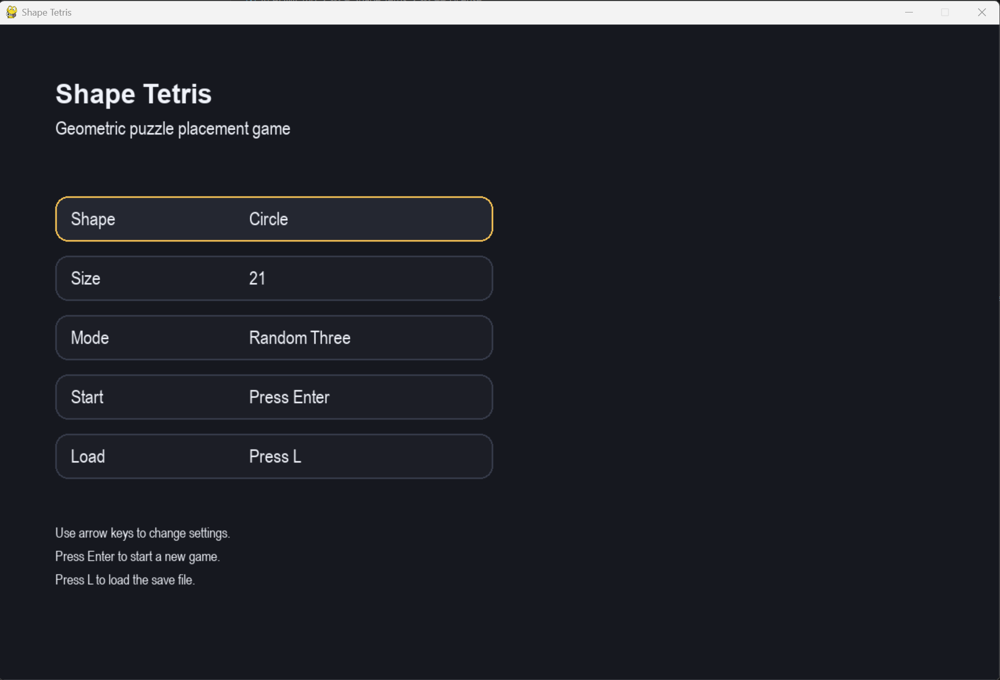
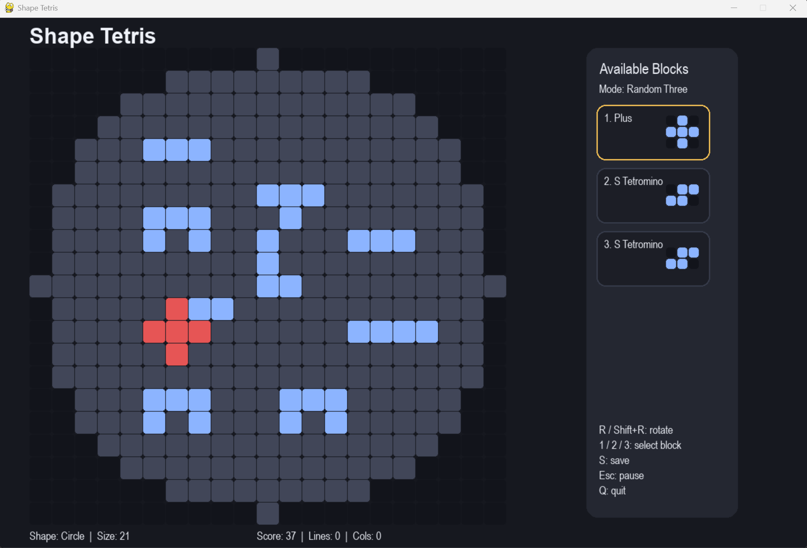

# Shape Tetris

A geometric puzzle game where classic Tetris logic meets non-rectangular boards and a fully testable architecture.

---

## Overview

Shape Tetris is a strategic puzzle game built in Python with pygame-ce, inspired by an academic project and redesigned into a clean, testable, and maintainable software system.

Instead of falling blocks, players place shapes manually on geometric boards (circle, diamond, triangle) to complete and clear rows and columns.

This project focuses on:
- clean architecture
- separation of concerns
- testability
- scalability

---

## Features

- Three geometric boards:
  - Circle
  - Diamond
  - Triangle
- Strategic block placement gameplay
- Block rotation system
- Row and column clearing
- Scoring system with combos
- Save / Load system (JSON)
- Two game modes:
  - Random three blocks
  - Full catalog
- Fully testable game engine
- Clean architecture (domain / app / UI)

---

## Screenshots




Replace these images with your actual screenshots.

---

## Why this project matters

This is not a simple Tetris clone.

It demonstrates:
- how to transform an academic prototype into a production-ready project
- how to design a testable game engine
- how to structure a Python project for maintainability
- how to separate domain logic from UI cleanly

---

## Architecture

```
shape-tetris/
├─ src/shape_tetris/
│  ├─ game/       # Core domain logic (pure Python)
│  ├─ app/        # Application orchestration
│  ├─ ui/         # Rendering and input (pygame)
│  └─ main.py
├─ tests/         # Unit tests
├─ configs/
├─ docs/
```

Key principles:
- Core engine independent from UI
- Clear data models
- Testable rules
- No global state
- Modular and extensible

---

## Technical Highlights

- Pure Python game engine (no UI dependency)
- Deterministic game state and reproducibility
- Clear separation between domain models
- Explicit rule system (placement, clearing, scoring)
- JSON-based persistence layer
- Scalable architecture for future features

---

## Testing

The project includes a full test suite using pytest.

Covered components:
- placement validation
- rotation logic
- row and column clearing
- scoring system
- game over detection

Run tests:

```
py -m pytest
```

---

## Tech Stack

- Python 3.11+
- pygame-ce
- pytest
- ruff

---

## Installation

```
git clone https://github.com/MatALass/shape-tetris.git
cd shape-tetris

py -m venv .venv
.venv\Scripts\activate

py -m pip install --upgrade pip
py -m pip install -e .[dev]
```

---

## Run the game

```
shape-tetris
```

or

```
py -m shape_tetris.main
```

---

## Controls

Menu:
- Up / Down: navigate
- Left / Right: change option
- Enter: confirm
- L: load save

In-game:
- Mouse: place blocks
- 1 / 2 / 3: select block
- R: rotate clockwise
- Shift + R / E: rotate counterclockwise
- S: save
- ESC: pause
- Q: quit

---

## Roadmap

v1.0.0:
- Core gameplay
- UI
- Save / load
- Testable engine

v1.1:
- UI polish
- Better UX feedback
- Improved scoring balance

v2:
- Animations
- High scores
- Themes
- Sound design

---

## Release

Current version: v1.0.0

Future releases will include gameplay balancing, visual improvements, and additional features.

---

## License

MIT License
